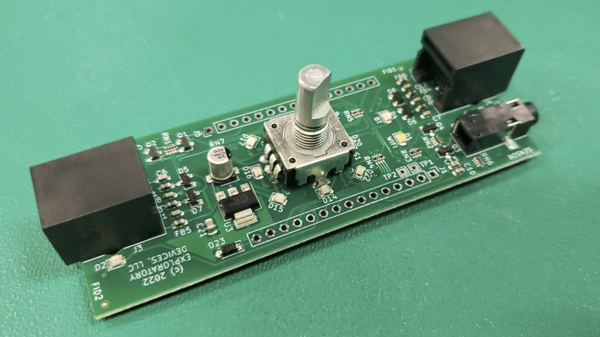

# Nimble Connectivity Module - Hardware Specifications

## April 20, 2022

### Hardware specs
- 1x [ESP32-based controller](https://www.espressif.com/en/products/socs/esp32) 
    - Dual core Xtensa 32-bit LX6 microprocessors
    - Onboard WiFi, Bluetooth, USB
    - Arduino compatible
- 1x Actuator communications port (Label "A")
    - [6P2C RJ11](https://en.wikipedia.org/wiki/Registered_jack#RJ11,_RJ14,_RJ25_wiring) female plug (telephone line connection to actuator)
    - Pin 1: Unused
    - Pin 2: +12v (or +8v, depending on manufacture date)
    - Pin 3: TX (at 5v)
    - Pin 4: RX (at 5v)
    - Pin 5: GND
    - Pin 6: Unused
- 1x Control pendant communications port (Label "P")
    - [6P2C RJ11](https://en.wikipedia.org/wiki/Registered_jack#RJ11,_RJ14,_RJ25_wiring) female plug (telephone line connection to pendant)
    - Same pinout as actuator port
- 1x Analog sensor input 1/8" TRS. 0-5V signal with power supply (Label "S")
    - Tip = 5V 
    - Ring = Sensor input (0-5V range) 
    - Shaft = Ground
- 1x Micro-USB 2.0 port 12 Mbps
    - Displays as "[Silicon Laboratories CP2102 USB to UART Bridge Controller](https://www.silabs.com/interface/usb-bridges/classic/device.cp2102?tab=techdocs)"
- 1x [24PPR clickable encoder](https://howtomechatronics.com/tutorials/arduino/rotary-encoder-works-use-arduino/) (Dial)
- 8x LEDs around the encoder ring (green)
- 4x Other LEDs:
    - Actuator connectivity LED (green)
    - Pendant connectivity LED (green)
    - Bluetooth status LED (blue)
    - Wifi status LED (white)

### Control Pendant Transmit Protocol

<table>
  <tr>
    <th>Byte</th>
    <th>Name</th>
    <th>Bit 7</th>
    <th>Bit 6</th>
    <th>Bit 5</th>
    <th>Bit 4</th>
    <th>Bit 3</th>
    <th>Bit 2</th>
    <th>Bit 1</th>
    <th>Bit 0</th>
    <th>Description</th>
  </tr>
  <tr>
    <td>0</td>
    <td>Status</td>
    <td colspan="3">SYSTEM_TYPE</td>
    <td>SET_EXTEN</td>
    <td>AIR_SPRING</td>
    <td>AIR_IN</td>
    <td>AIR_OUT</td>
    <td>ACK</td>
    <td>Status Byte</td>
  </tr>
  <tr>
    <td>1</td>
    <td>PositionL</td>
    <td colspan="8">POSITION_COMMAND_L</td>
    <td rowspan="2">Position command bytes (10 bits, -1000 to 1000 with sign bit)</td>
  </tr>
  <tr>
    <td>2</td>
    <td>PositionH</td>
    <td colspan="3">NODE_TYPE</td>
    <td>0</td>
    <td>0</td>
    <td>sign</td>
    <td colspan="2">POSITION_COMMAND_H</td>
  </tr>
  <tr>
    <td>3</td>
    <td>ForceL</td>
    <td colspan="8">FORCE_COMMAND_L</td>
    <td rowspan="2">Force command bytes (10 bits, 0 to 1023)</td>
  </tr>
  <tr>
    <td>4</td>
    <td>ForceH</td>
    <td>0</td>
    <td>0</td>
    <td>0</td>
    <td>0</td>
    <td>0</td>
    <td>0</td>
    <td colspan="2">FORCE_COMMAND_H</td>
  </tr>
  <tr>
    <td>5</td>
    <td>ChecksumL</td>
    <td colspan="8">CHECKSUM_L</td>
    <td rowspan="2">Simple Sum of bytes 0-4</td>
  </tr>
  <tr>
    <td>6</td>
    <td>ChecksumH</td>
    <td colspan="8">CHECKSUM_H</td>
  </tr>
</table>

### Actuator Transmit Protocol

<table>
  <tr>
    <th>Byte</th>
    <th>Name</th>
    <th>Bit 7</th>
    <th>Bit 6</th>
    <th>Bit 5</th>
    <th>Bit 4</th>
    <th>Bit 3</th>
    <th>Bit 2</th>
    <th>Bit 1</th>
    <th>Bit 0</th>
    <th>Description</th>
  </tr>
  <tr>
    <td>0</td>
    <td>Status</td>
    <td colspan="3">SYSTEM_TYPE</td>
    <td>0</td>
    <td>AIR_SPRING</td>
    <td>TEMP_LIMIT</td>
    <td>SENSOR_FAULT</td>
    <td>ACK</td>
    <td>Status Byte</td>
  </tr>
  <tr>
    <td>1</td>
    <td>PositionL</td>
    <td colspan="8">POSITION_FEEDBACK_L</td>
    <td rowspan="2">Position feedback bytes (10 bits, -1000 to 1000  with sign bit)</td>
  </tr>
  <tr>
    <td>2</td>
    <td>PositionH</td>
    <td colspan="3">NODE_TYPE</td>
    <td>0</td>
    <td>0</td>
    <td>sign</td>
    <td colspan="2">POSITION_FEEDBACK_H</td>
  </tr>
  <tr>
    <td>3</td>
    <td>ForceL</td>
    <td colspan="8">FORCE_FEEDBACK_L</td>
    <td rowspan="2">Force feedback bytes (10 bits, -1023 to 1023  with sign bit)</td>
  </tr>
  <tr>
    <td>4</td>
    <td>ForceH</td>
    <td>0</td>
    <td>0</td>
    <td>0</td>
    <td>0</td>
    <td>0</td>
    <td>sign</td>
    <td colspan="2">FORCE_FEEDBACK_H</td>
  </tr>
  <tr>
    <td>5</td>
    <td>ChecksumL</td>
    <td colspan="8">CHECKSUM_L</td>
    <td rowspan="2">Simple Sum of bytes 0-4</td>
  </tr>
  <tr>
    <td>6</td>
    <td>ChecksumH</td>
    <td colspan="8">CHECKSUM_H</td>
  </tr>
</table>

System Type for NimbleStroker is 0b100. All others reserved.
Node Type for NimbleStroker is 0b000 for NimbleStroker control pendant and 0b001 for NimbleStroker Actuator. All others reserved.
